# 🏥 Prenatal Digital SUS

## Tech Challenge - Sistema de Pré-Natal Digital

---

## 📑 ÍNDICE

- [Descrição do Projeto](#-descrição-do-projeto)
- [Funcionalidades e Endpoints](#-funcionalidades-e-endpoints)
  - [Auth Service](#-auth-service)
  - [Agenda Service](#-agenda-service)
  - [Prontuário Service](#-prontuário-service)
  - [Documento Service](#-documento-service)
  - [Alertas Service](#-alertas-service)
- [Tecnologias Utilizadas](#️-tecnologias-utilizadas)
- [Segurança](#-segurança)
- [Estrutura do Projeto](#-estrutura-do-projeto)
- [Clean Architecture](#-clean-architecture)
- [Diagrama de Arquitetura](#-diagrama-de-arquitetura)
- [Fluxogramas do Projeto](#-fluxogramas-do-projeto)
- [Diagrama do Banco de Dados](#-diagrama-do-banco-de-dados)
- [Requisitos](#-requisitos)
- [Como Rodar o Projeto](#-como-rodar-o-projeto)
- [Documentação da API](#-documentação-da-api)
- [Cobertura de Código](#-cobertura-de-código)
- [Collection e Environment Postman](#-collection-e-environment-postman)
- [Fluxo de Autenticação](#-fluxo-de-autenticação)

---

## 📌 Descrição do Projeto

O **Prenatal Digital SUS** é uma API modular e containerizada que oferece:

- **Autenticação e geração de token JWT** via OAuth2.
- **Agendamento de consultas pré-natais** com base na disponibilidade dos profissionais.
- **Prontuário eletrônico** para gestantes com histórico clínico.
- **Upload e gestão de documentos** (exames, vacinas) com armazenamento em S3.
- **Motor de alertas** que analisa as gestações e envia notificações por e-mail.

O sistema utiliza um banco PostgreSQL compartilhado com schemas isolados por serviço e comunicação síncrona via REST, com validação JWT em todos os endpoints protegidos.

---

## ⚙️ Funcionalidades e Endpoints

### 🔐 Auth Service (porta 8079)

| Operação | Descrição | Acesso |
|----------|-----------|--------|
| POST   /oauth2/token | Gera token JWT (grant_type=password) | Público |
| POST   /v1/usuarios | Cria novo usuário | Autenticado |
| GET    /v1/usuarios/cpf/{cpf} | Obtém usuário por CPF | Autenticado |
| GET    /v1/usuarios/{id} | Obtém usuário por ID | Autenticado |
| PUT    /v1/usuarios/{id} | Atualiza usuário | Autenticado |
| PATCH  /v1/usuarios/{id}/senha | Altera senha | Autenticado |

---

### 📅 Agenda Service (porta 8080)

| Operação | Descrição | Acesso |
|----------|-----------|--------|
| POST   /api/consultas/agendar | Agenda nova consulta | Autenticado |
| DELETE /api/consultas/{id}/cancelar | Cancela consulta | Autenticado |
| GET    /api/disponibilidade | Lista horários disponíveis (médico, data) | Autenticado |
| GET    /api/gestantes/consultas | Lista consultas por CPF | Autenticado |
| GET    /api/gestantes/{id}/consultas | Lista consultas da gestante | Autenticado |
| POST   /api/agendas/medico | Cadastra agenda do médico | Autenticado |
| GET    /api/agendas/medico/{crm} | Obtém agenda do médico | Autenticado |
| PUT    /api/agendas/medico/{crm} | Atualiza agenda | Autenticado |
| DELETE /api/agendas/medico/{crm} | Remove agenda | Autenticado |

---

### 📖 Prontuário Service (porta 8082)

| Operação | Descrição | Acesso |
|----------|-----------|--------|
| POST   /api/v1/prontuarios | Cria prontuário | Autenticado |
| GET    /api/v1/prontuarios/cpf/{cpf} | Obtém prontuário por CPF | Autenticado |
| PUT    /api/v1/prontuarios/cpf/{cpf} | Atualiza prontuário | Autenticado |
| PATCH  /api/v1/prontuarios/cpf/{cpf}/fatores-risco | Atualiza fatores de risco | Autenticado |
| GET    /api/v1/prontuarios/cpf/{cpf}/historico | Obtém histórico do prontuário | Autenticado |

---

### 📄 Documento Service (porta 8081)

| Operação | Descrição | Acesso |
|----------|-----------|--------|
| POST   /api/prenatal-records/{cpf}/documents | Upload de documento (exame) | Autenticado |
| GET    /api/prenatal-records/{cpf}/documents | Lista documentos do paciente | Autenticado |
| GET    /api/documents/{id}/download | Download de documento | Autenticado |
| PATCH  /api/documents/{id}/inactivate | Inativa documento | Autenticado |
| DELETE /api/documents/{id}/permanent | Remove documento permanentemente | Autenticado |
| POST   /api/documents/{id}/request-delete | Solicita exclusão | Autenticado |
| POST   /api/prenatal-records/{cpf}/vacinas | Registra vacina | Autenticado |

---

### 📨 Alertas Service (porta 8084)

| Operação | Descrição | Acesso |
|----------|-----------|--------|
| Job agendado | Analisa gestações, gera alertas e envia e-mails | Interno |

O serviço de alertas executa periodicamente, consultando os dados de prontuário, agenda e documentos para identificar situações que exigem atenção (exames pendentes, vacinas em atraso, consultas) e notifica gestantes e médicos por e-mail.

**Obs.:** Para envio de e-mails, configure as variáveis de ambiente `SMTP_EMAIL` e `SMTP_PASSWORD` **nas variáveis de ambiente da máquina**. Ao subir com `docker compose up`, o Docker Compose obtém essas variáveis do ambiente da máquina e repassa aos containers.

---

## 🛡️ Segurança

| Validação | Descrição | Implementação |
|-----------|-----------|---------------|
| Autenticação JWT | Token obrigatório nas requisições protegidas | Spring Security OAuth2 Resource Server |
| JWKS | Validação de assinatura via endpoint /oauth2/jwks | prenatal-auth expõe chaves públicas |
| CORS | Origens permitidas configuráveis | application.properties |

---

## 🛠️ Tecnologias Utilizadas

| Stack | Tecnologia |
|-------|------------|
| Linguagem | Java 21 |
| Build | Maven |
| Framework | Spring Boot 3.x / 4.x |
| Banco de Dados | PostgreSQL 16 |
| Armazenamento | LocalStack (S3) |
| Autenticação | OAuth2 Authorization Server + JWT |
| Documentação | SpringDoc OpenAPI 3 (Swagger) |
| Containerização | Docker / Docker Compose |

---

## 📂 Estrutura do Projeto

```
prenatal-digital-sus/
├── README.md                        # Documentação principal do projeto
├── CONFIGURACAO-VARIAVEIS-AMBIENTE.md   # Guia de variáveis de ambiente (SMTP, Gmail, Windows)
├── prenatal-auth/           # Microsserviço de autenticação (OAuth2 + JWT)
├── prenatal-agenda/         # Microsserviço de agendamento de consultas
├── prenatal-prontuario/     # Microsserviço de prontuário eletrônico
├── prenatal-documento/      # Microsserviço de documentos e vacinas
├── prenatal-alertas/        # Motor de alertas e notificações por e-mail
├── docker-compose.yml       # Orquestração unificada dos serviços
├── docker/
│   └── postgres-init/
│       └── 01-create-schemas.sql   # Criação dos schemas
├── collection/              # Collections e environments do Postman
└── DOCKER.md                # Instruções detalhadas do Docker
```

---

## 🧹 Clean Architecture

Cada microsserviço segue os princípios da **Clean Architecture**, com camadas bem definidas:

- **application** – DTOs, use cases (regras de negócio)
- **domain** – Entidades, gateways (interfaces)
- **infrastructure** – Controllers, persistência, gateways (implementações)

### prenatal-auth

```
prenatal-auth/
├── src/main/java/br/com/hackathon/sus/prenatal_auth/
│   ├── application/
│   │   ├── dtos/
│   │   │   ├── requests/     (UserRequest, AddressRequest, PasswordRequest)
│   │   │   └── responses/    (UserResponse, AddressResponse)
│   │   └── usecases/
│   │       ├── CreateUserUseCase, CreateUserUseCaseImp
│   │       ├── FindUserByCpfUseCase, FindUserByCpfUseCaseImp
│   │       ├── FindUserByIdUseCase, FindUserByIdUseCaseImp
│   │       ├── UpdateUserUseCase, UpdateUserUseCaseImp
│   │       └── UpdatePasswordUseCase, UpdatePasswordUseCaseImp
│   ├── domain/
│   │   ├── entities/        (User, Address, Role)
│   │   └── gateways/        (UserGateway, RoleGateway)
│   └── infrastructure/
│       ├── config/          (AuthorizationServer, Security, DependencyInjection)
│       ├── controllers/     (UserController)
│       ├── exceptions/      (GlobalExceptionHandler)
│       ├── gateways/        (UserGatewayImpl, RoleGatewayImpl)
│       └── persistence/     (UserEntity, UserRepository, RoleRepository)
├── Dockerfile
└── pom.xml
```

### prenatal-agenda

```
prenatal-agenda/
├── src/main/java/br/com/hackathon/sus/prenatal_agenda/
│   ├── application/
│   │   ├── dtos/            (CreateAppointmentRequest, AppointmentResponse, etc.)
│   │   └── usecases/
│   │       ├── CreateAppointmentUseCase, CancelAppointmentUseCase
│   │       ├── CreateDoctorScheduleUseCase, ListAvailabilityUseCase
│   │       └── FindAppointmentsByPatientUseCase, etc.
│   ├── domain/
│   │   ├── entities/        (Appointment, DoctorSchedule, Weekday)
│   │   └── gateways/        (AppointmentGateway, DoctorScheduleGateway)
│   └── infrastructure/
│       ├── config/          (Flyway, Security, DependencyInjection)
│       ├── controllers/     (AppointmentController, AvailabilityController, etc.)
│       ├── gateways/        (AppointmentGatewayImpl, DoctorScheduleGatewayImpl)
│       └── persistence/     (AppointmentEntity, DoctorScheduleEntity)
├── Dockerfile
└── pom.xml
```

### prenatal-prontuario

```
prenatal-prontuario/
├── src/main/java/com/hackathon/sus/prenatal_prontuario/
│   ├── application/
│   │   ├── dtos/            (CreateMedicalRecordRequest, MedicalRecordResponse, etc.)
│   │   └── usecases/
│   │       ├── CreateMedicalRecordUseCase, UpdateMedicalRecordUseCase
│   │       ├── FindMedicalRecordByCpfUseCase, FindMedicalRecordHistoryUseCase
│   │       └── UpdateRiskFactorsUseCase, etc.
│   ├── domain/
│   │   ├── entities/        (MedicalRecord, MedicalRecordHistory, RiskFactor)
│   │   └── gateways/        (MedicalRecordGateway, MedicalRecordHistoryGateway)
│   └── infrastructure/
│       ├── config/          (Flyway, Security, DependencyInjection)
│       ├── controllers/     (MedicalRecordController)
│       ├── gateways/        (MedicalRecordGatewayImpl)
│       └── persistence/     (MedicalRecordEntity, MedicalRecordRepository)
├── Dockerfile
└── pom.xml
```

### prenatal-documento

```
prenatal-documento/
├── src/main/java/br/com/hackathon/sus/prenatal_documento/
│   ├── application/
│   │   ├── dtos/            (UploadDocumentRequest, DocumentResponse, VaccineResponse)
│   │   └── usecases/
│   │       ├── UploadDocumentUseCase, DownloadDocumentUseCase
│   │       ├── ListDocumentsUseCase, RegisterVaccineUseCase
│   │       ├── DeleteDocumentUseCase, InactivateDocumentUseCase
│   │       └── RequestDeleteDocumentUseCase
│   ├── domain/
│   │   ├── models/          (MedicalDocument, Vaccine)
│   │   ├── repositories/    (MedicalDocumentRepository, VaccineRepository)
│   │   └── gateways/        (StorageGateway)
│   └── infrastructure/
│       ├── config/          (S3Config, Flyway, Security)
│       ├── controllers/     (DocumentController, VaccineController)
│       ├── gateways/        (S3StorageGateway)
│       └── persistence/     (MedicalDocumentEntity, VaccineEntity)
├── Dockerfile
└── pom.xml
```

### prenatal-alertas

```
prenatal-alertas/
├── src/main/java/br/com/hackathon/sus/prenatal_alertas/
│   ├── application/
│   │   └── usecases/        (AnalyzeAllPregnanciesUseCase, AnalyzeAllPregnanciesUseCaseImpl)
│   ├── domain/
│   │   ├── entities/        (PregnantPatient, PrenatalAlert, ExamRecord, VaccineRecord)
│   │   ├── enums/           (AlertType, AlertSeverity, NotificationTarget)
│   │   ├── gateways/        (NotificationOrchestratorGateway)
│   │   └── repositories/    (ProntuarioRepository, AgendaRepository, DocumentoRepository)
│   └── infrastructure/
│       ├── gateways/        (DirectSmtpNotificationGatewayImpl)
│       ├── persistence/     (ProntuarioRepositoryImpl, AgendaRepositoryImpl, DocumentoRepositoryImpl)
│       └── scheduler/       (PrenatalAnalysisScheduler)
├── Dockerfile
└── pom.xml
```

---

## 📡 Diagrama de Arquitetura

Os diagramas principais são exibidos em PNG para melhor visualização. Código-fonte em [docs/diagrams/](docs/diagrams/) (arquivos `.mmd`).

### Visão Geral dos Serviços

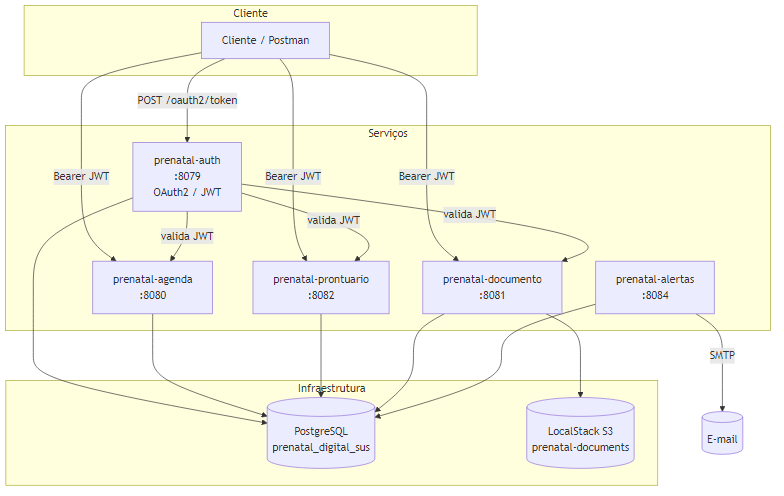

### Fluxo de Comunicação e Dependências

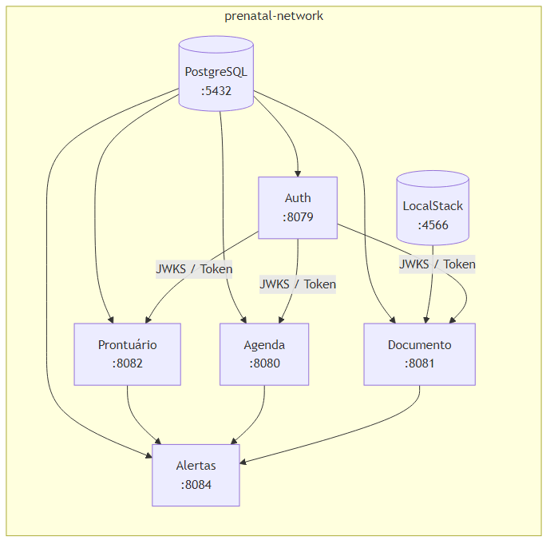

### Fluxo de Autenticação

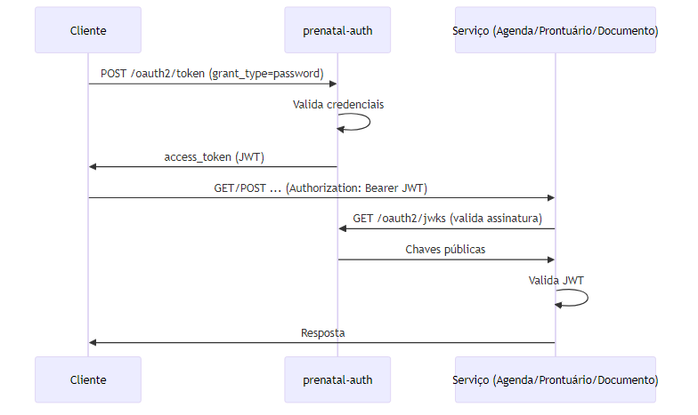

---

## 📊 Fluxogramas do Projeto

### Fluxograma 1: Onboarding e Cadastro Inicial

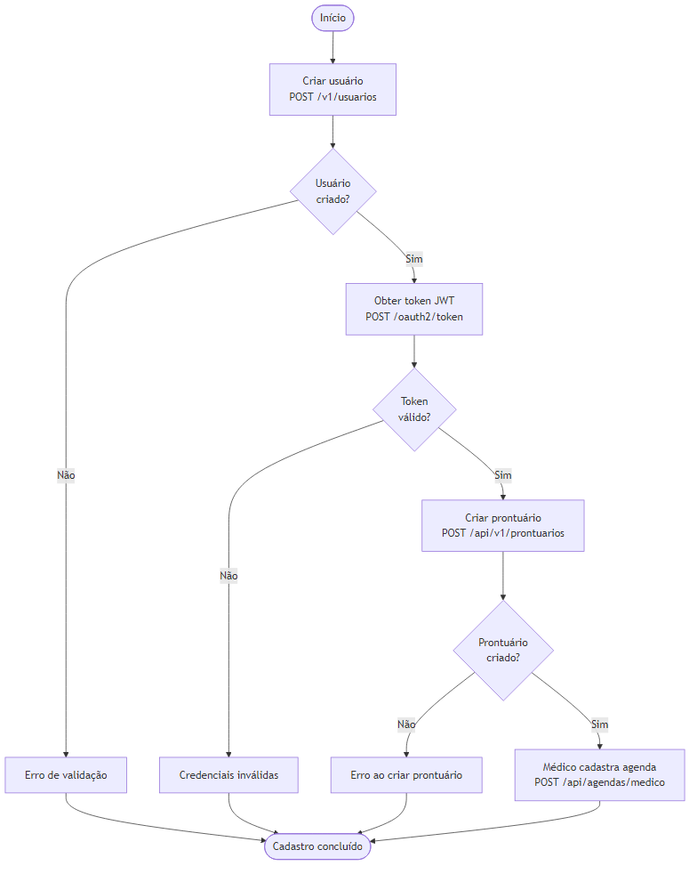

### Fluxograma 2: Agendamento de Consulta

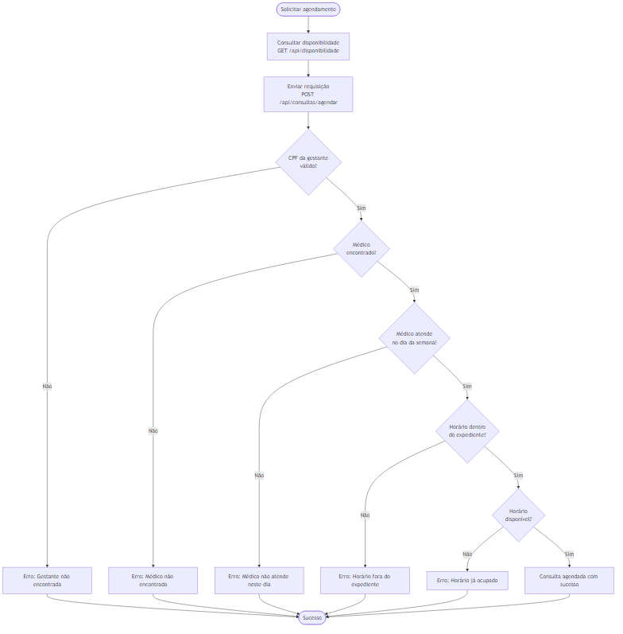

### Fluxograma 3: Upload e Gestão de Documentos

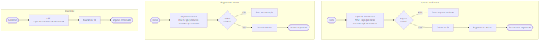

### Fluxograma 4: Motor de Alertas (prenatal-alertas)

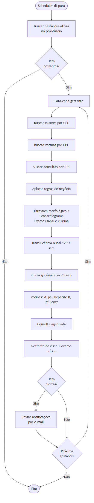

### Fluxograma 5: Ciclo Completo do Pré-Natal

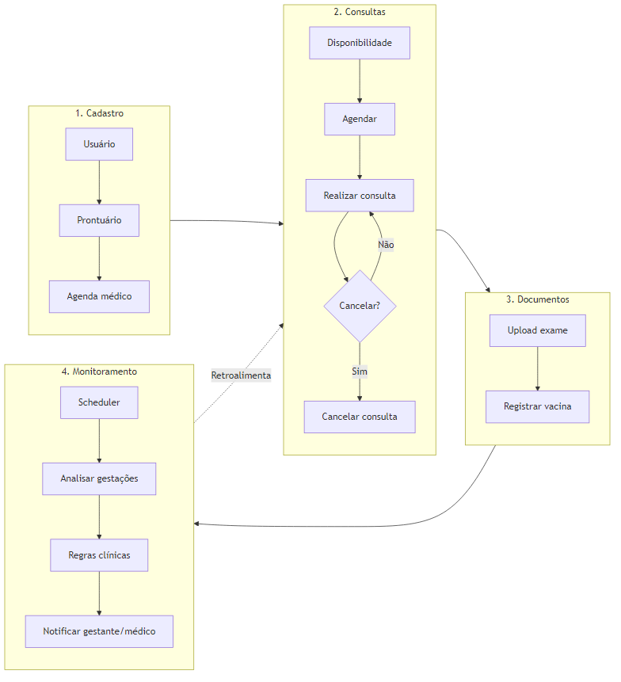

### Fluxograma 6: Cancelamento de Consulta


---

## 🗄️ Diagrama do Banco de Dados

### Visão Geral da Arquitetura de Dados

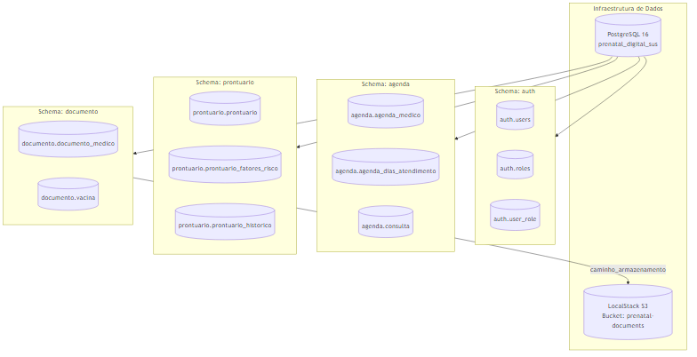

### Diagrama Entidade-Relacionamento


### Schemas e Serviços

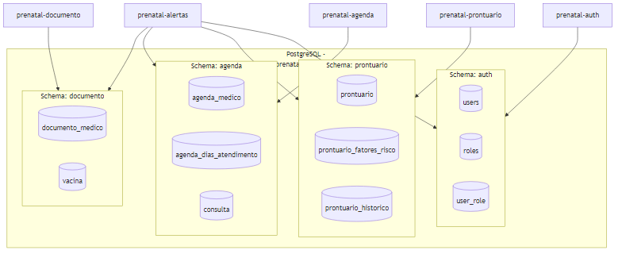

---

## 🗄️ Banco de Dados

- **PostgreSQL 16** com um único banco `prenatal_digital_sus`
- **Schemas isolados:** `auth`, `prontuario`, `agenda`, `documento`
- **Flyway** em cada serviço para migrações
- Script de init em `docker/postgres-init/01-create-schemas.sql`

---

## 📋 Requisitos

- Java 21
- Maven 3.9+
- Docker e Docker Compose
- Postman (para testes de API)

---

## ▶️ Como Rodar o Projeto

### Via Docker Compose (recomendado)

Na raiz do projeto:

```bash
# Subir todos os serviços
docker compose up --build -d

# Acompanhar logs
docker compose logs -f

# Parar
docker compose down
```

### Variáveis de ambiente (envio de e‑mail via Gmail)

As variáveis de ambiente abaixo são usadas pelo serviço de alertas para enviar e‑mails:

- **`SMTP_EMAIL`** → seu e‑mail do Gmail (ex: `seu-email@gmail.com`)
- **`SMTP_PASSWORD`** → senha de app gerada no Gmail (NÃO é a senha normal da conta)

**Regra do projeto:** essas variáveis **devem estar definidas nas variáveis de ambiente da máquina**. Ao executar `docker compose up`, o Docker Compose **obtém** os valores das variáveis de ambiente definidas na máquina e repassa aos containers. Não é usado arquivo `.env` no projeto.

**Guia completo:** [CONFIGURACAO-VARIAVEIS-AMBIENTE.md](CONFIGURACAO-VARIAVEIS-AMBIENTE.md) (na raiz do projeto).

---

### 1️⃣ Etapa obrigatória no Gmail: gerar senha de app

Para usar Gmail como servidor SMTP, você precisa **obrigatoriamente** gerar uma **senha de app**.  
Resumo do processo (feito uma única vez por conta):

- **Passo 1 – Ativar verificação em duas etapas**
  1. Acesse `https://myaccount.google.com/security`
  2. Em **“Como fazer login no Google”**, clique em **“Verificação em duas etapas”**
  3. Siga o passo a passo (confirmação por SMS, etc.) até ficar **ATIVADA**

- **Passo 2 – Gerar a senha de app**
  1. Acesse `https://myaccount.google.com/apppasswords`
  2. Faça login se for pedido
  3. Em **“Selecionar app”**, escolha **“Mail”**
  4. Em **“Selecionar dispositivo”**, escolha **“Outro (nome personalizado)”**
  5. Digite um nome (ex.: `Prenatal Digital SUS`) e clique em **“Gerar”**
  6. O Google vai mostrar uma senha de **16 caracteres** (ex.: `abcd efgh ijkl mnop`)
  7. **Copie essa senha** e remova os espaços, ficando assim: `abcdefghijklmnop`

> Essa senha de 16 caracteres (sem espaços) é o valor que será usado em `SMTP_PASSWORD`.

---

### 2️⃣ Criar as variáveis de ambiente no Windows (manual)

Configuração **manual**, direto nas variáveis de ambiente do Windows:

1. Pressione `Win + R`, digite `sysdm.cpl` e pressione **Enter**
2. Na janela **“Propriedades do Sistema”**, vá na aba **“Avançado”**
3. Clique no botão **“Variáveis de Ambiente...”**
4. Na seção **“Variáveis de usuário”**, clique em **“Novo...”**
   - **Nome da variável:** `SMTP_EMAIL`  
   - **Valor da variável:** seu e‑mail Gmail completo (ex.: `seu-email@gmail.com`)  
   - Clique em **OK**
5. Ainda em **“Variáveis de usuário”**, clique de novo em **“Novo...”**
   - **Nome da variável:** `SMTP_PASSWORD`  
   - **Valor da variável:** a senha de app de 16 caracteres gerada na etapa do Gmail (sem espaços), ex.: `abcdefghijklmnop`  
   - Clique em **OK**
6. Clique em **OK** na janela de **“Variáveis de Ambiente”**
7. Clique em **OK** na janela de **“Propriedades do Sistema”**
8. **Feche completamente** o PowerShell / CMD que estiver aberto
9. Abra um **novo** PowerShell / CMD

---

### 3️⃣ Conferir se as variáveis foram criadas

No **novo** PowerShell, digite:

```powershell
echo $env:SMTP_EMAIL
echo $env:SMTP_PASSWORD
```

- Se aparecerem os valores configurados, está correto.
- Se vier em branco, revise os passos de criação das variáveis no Windows.

Depois disso, você já pode subir o projeto com:

```powershell
docker compose up --build -d
```

e acompanhar os logs do serviço de alertas:

```powershell
docker compose logs -f prenatal-alertas
```

Se as variáveis estiverem corretas, o serviço conseguirá autenticar no Gmail e enviar os e‑mails.

### Portas e URLs

| Serviço          | Porta | URL Base                |
|------------------|-------|-------------------------|
| prenatal-auth    | 8079  | http://localhost:8079   |
| prenatal-agenda  | 8080  | http://localhost:8080   |
| prenatal-documento | 8081| http://localhost:8081   |
| prenatal-prontuario | 8082| http://localhost:8082   |
| prenatal-alertas | 8084  | http://localhost:8084   |
| PostgreSQL       | 5432  | localhost:5432          |
| LocalStack (S3)  | 4566  | http://localhost:4566   |

---

## 📚 Documentação da API

Cada serviço expõe **Swagger UI** em:

- Auth: http://localhost:8079/swagger-ui.html
- Agenda: http://localhost:8080/swagger-ui.html
- Documento: http://localhost:8081/swagger-ui.html
- Prontuário: http://localhost:8082/swagger-ui.html
- Alertas: http://localhost:8084/swagger-ui.html

---

## 📊 Cobertura de Código

Todas as aplicações usam **JaCoCo** para cobertura de testes. O relatório é gerado automaticamente ao rodar os testes. Instruções detalhadas e comandos: [scripts/COBERTURA-CODIGO.md](scripts/COBERTURA-CODIGO.md).

Relatórios visuais da cobertura por projeto estão na pasta [docs/coverage](docs/coverage/):

| Projeto | Imagem |
|---------|--------|
| prenatal-auth | [prenatal-auth.png](docs/coverage/prenatal-auth.png) |
| prenatal-agenda | [prenatal-agenda.png](docs/coverage/prenatal-agenda.png) |
| prenatal-prontuario | [prenatal-prontuario.png](docs/coverage/prenatal-prontuario.png) |
| prenatal-documento | [prenatal-documento.png](docs/coverage/prenatal-documento.png) |
| prenatal-alertas | [prenatal-alertas.png](docs/coverage/prenatal-alertas.png) |

### Cobertura por projeto (visão geral)

#### prenatal-auth
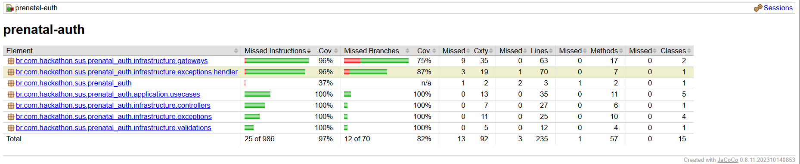

#### prenatal-agenda
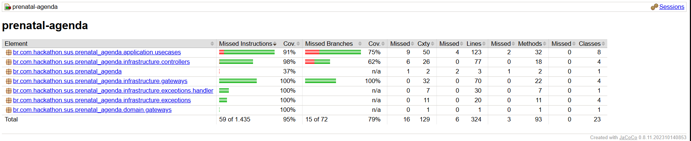

#### prenatal-prontuario
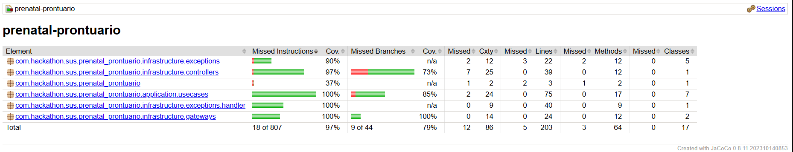

#### prenatal-documento
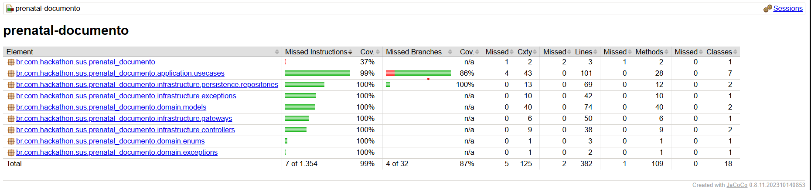

#### prenatal-alertas
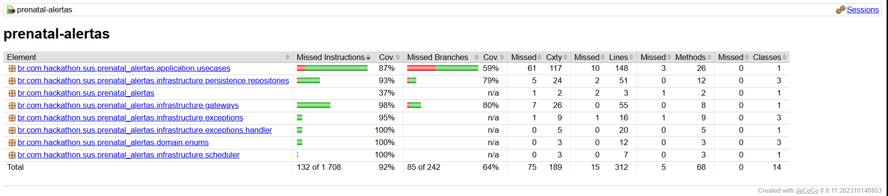

### Rodar cobertura em todas as aplicações

Na **raiz do projeto**:

**PowerShell:**
```powershell
.\scripts\coverage.ps1
```

**CMD:**
```cmd
scripts\coverage.cmd
```

O script executa `mvn clean test` em cada módulo (prenatal-auth, prenatal-agenda, prenatal-prontuario, prenatal-documento, prenatal-alertas). Ao final, os relatórios ficam em cada pasta do módulo.

### Rodar cobertura em um único módulo

```bash
cd prenatal-auth   # ou prenatal-agenda, prenatal-prontuario, prenatal-documento, prenatal-alertas
mvn clean test
```

### Onde ver o relatório

| Módulo            | Caminho do relatório (HTML)                    |
|-------------------|-------------------------------------------------|
| prenatal-auth     | `prenatal-auth/target/site/jacoco/index.html`   |
| prenatal-agenda   | `prenatal-agenda/target/site/jacoco/index.html` |
| prenatal-prontuario | `prenatal-prontuario/target/site/jacoco/index.html` |
| prenatal-documento | `prenatal-documento/target/site/jacoco/index.html` |
| prenatal-alertas  | `prenatal-alertas/target/site/jacoco/index.html`  |

Abra o `index.html` no navegador para ver cobertura de instruções, ramos e linhas por pacote. Configuração do JaCoCo (exclusões de config, DTOs, entities) está no `pom.xml` de cada módulo.

---

## 🧪 Collection e Environment Postman

- **Collection:** `collection/Prenatal-Digital-SUS-API-Unificada.postman_collection.json`
- **Environment:** `collection/Prenatal-Digital-SUS-Local.postman_environment.json`

Importe ambos no Postman e configure o token JWT obtido em `POST /oauth2/token` do prenatal-auth.

---

## 🔒 Fluxo de Autenticação

1. Obter token: `POST http://localhost:8079/oauth2/token` com `grant_type=password`, `username`, `password`, `client_id`, `client_secret`
2. Usar o `access_token` no header: `Authorization: Bearer {token}`
3. Acessar os demais serviços (agenda, prontuário, documento) com o mesmo token
